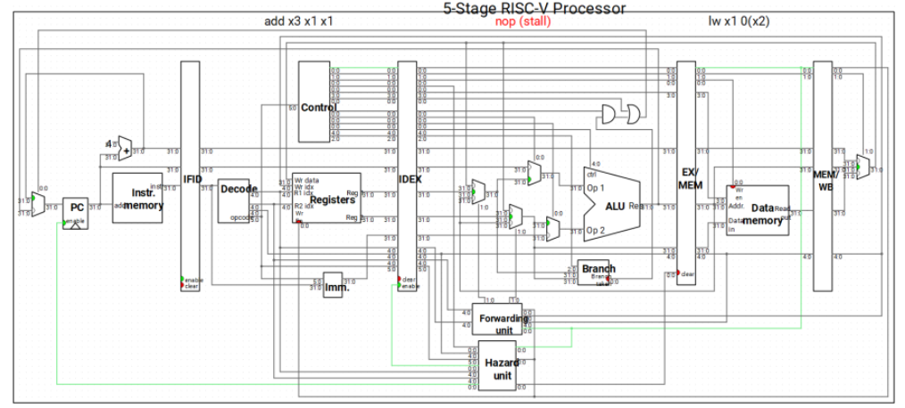
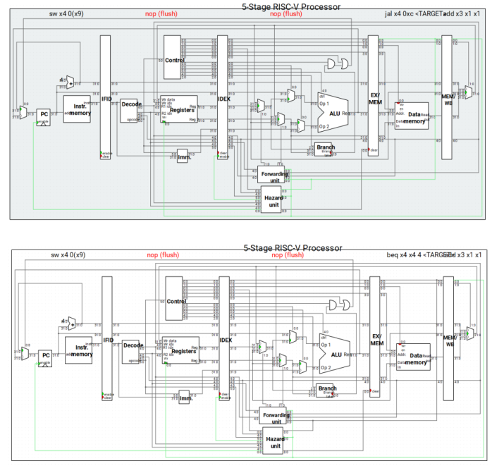
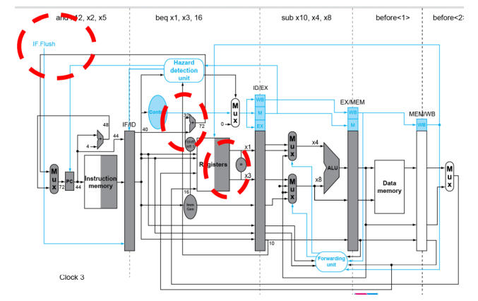
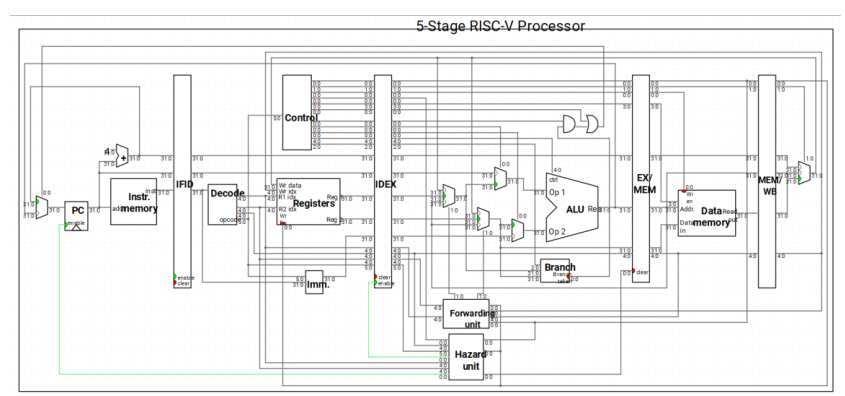
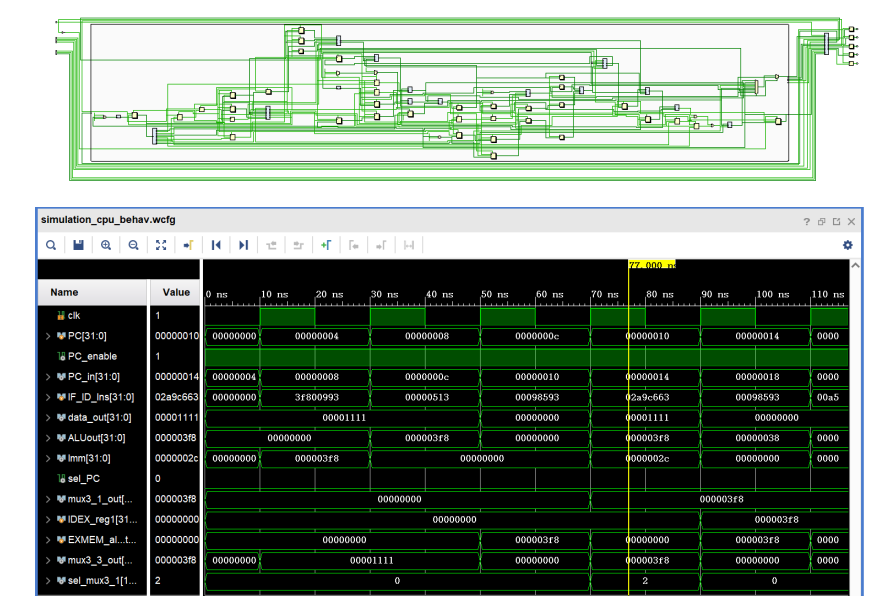
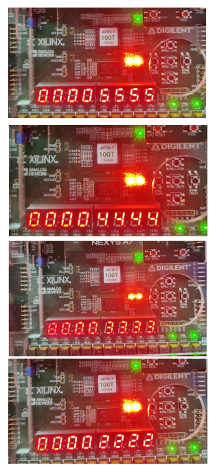
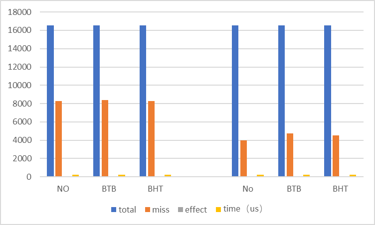
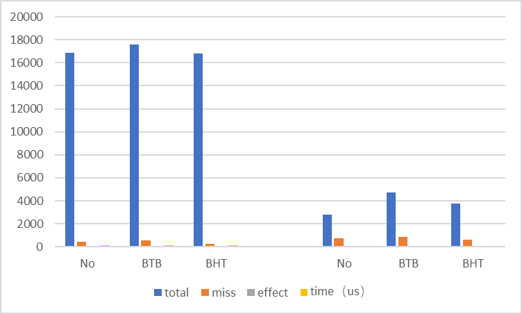

This project is about a 5-stage RISC-5 pipeline CPU with cache, branch prediction and I/O system.

Developed by Verilog, Vivado.

The CPU structure is as follows:

Control Correlation: control correlation occurs when the pipeline encounters branch instructions and other instructions that change the value of the PC:

This is solved by the Hazard module:

Total data path of the CPU (instruction information is stored through inter-segment registers):

Simulation results as well as results of datapath runs:

The sorting results on the FPGA development board are as follows:

BTB: Branch Target Buffer.
BHT: Branch History Table.
Below are the two different branch predictions for Bubble Sort and Rapid Sort.

